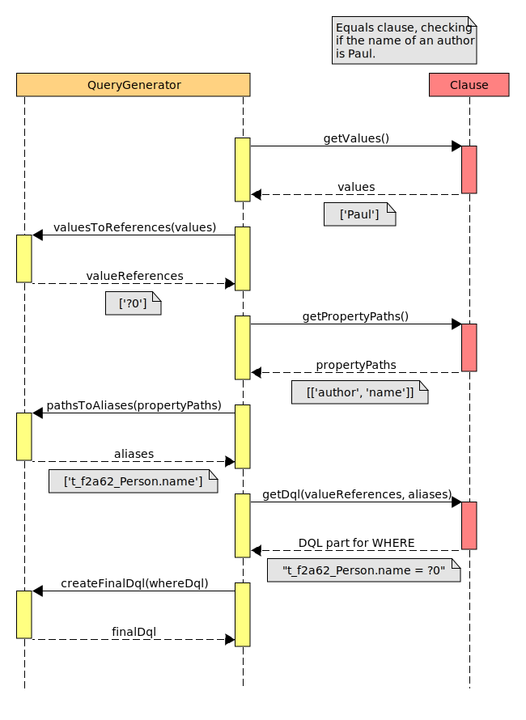

# Writing DQL Clauses

If you have a special need in which the provided clauses
do not suffice you can write your own. Custom clause implementations
will be used by the library in the same way as the provided ones.

In this tutorial we will first take a look at the theoretical concept
of the `ClauseInterface`
which all clauses must implement and then
examine a couple of example clause classes to understand how they work.

The actual implementation of the following examples in the library may differ
as they extend parent classes as well as use traits and Doctrines `Expr`
class for code re-usage. To keep the examples simple these optimizations
are avoided here.

## ClauseInterface

Instances of the `ClauseInterface`
are the primary building blocks to generate queries. They contain and provide the information how
a set of values and property paths should be converted into a DQL clause. The interface
is not only used for conditions but for sort methods, resulting in `ORDER BY` definitions, as well.

A clause may need paths to properties, and values the properties
are to be compared with. Both are passed into the `asDql` method
by the library. The method is then expected to return the DQL as a string or
one of Doctrines DQL classes. The library will use the returned DQL
directly in the `WHERE` condition in the final DQL.
 
This procedure becomes a bit more complex because the values and property paths
need to be converted before they can be passed into the `asDql` method.
These conversions are done by the library, but the condition class needs to provide
the original values and paths to be converted.
Raw values become parameter indices and join aliases will be generated from property paths.

When implementing the `ClauseInterface` the developer first needs to provide a way to
pass the raw values and property paths into an object instantiated from the class, using
a constructor, setters or publicly writable properties. The library is provided access to those
by implementing `getClauseValues()` and `getPropertyPaths()`. After the conversion, the `asDql` will be
called by the library with the converted values and paths.

If it is still confusing the following image visualizes the work in the library after the
clause has been instantiated and paths and values were set in it:



### AlwaysFalse

The simplest clauses are the ones that do not access
any property and do not need any values. The `AlwaysFalse`
class is such a clause as it will always evaluate to false.
All clauses
need to implement the three methods in the  `ClauseInterface`
but as we do not need values and paths the `getClauseValues()` and
`getPropertyPaths()` can return an empty array. The only implementation
that matters in this case is the `asDql` method.

```php
<?php
namespace EDT\DoctrineQueryGenerator\Conditions;
use EDT\DqlQuerying\Contracts\ClauseInterface;
class AlwaysFalse implements ClauseInterface
{
    public function getClauseValues(): array
    {
        return [];
    }
    public function getPropertyPaths(): array
    {
        return [];
    }
    public function asDql(array $valueIndices, array $propertyAliases)
    {
        return '1 = 2';
    }
}
```

`asDql` returns the string that is directly used in the `WHERE` condition of the final DQL.
`1 = 2` is kind of a workaround here to express `false`, as returning `'false'` is not supported
by some DBMS/DBMS drivers.

### PropertyIsEmpty

For a more complex example we use a `PropertyIsEmpty` condition that can be applied on
a to-many relationship property.

```php
namespace EDT\DoctrineQueryGenerator\Conditions;
use EDT\DqlQuerying\Contracts\ClauseInterface;
use EDT\Querying\PropertyPaths\PathInfo;use EDT\Querying\PropertyPaths\PropertyPath;
class PropertyIsEmpty implements ClauseInterface
{
    private $paths;
    public function __construct(array $propertyPath) {
        $this->paths = [new PathInfo(
            new PropertyPath(null, '', PropertyPath::DIRECT, $propertyPath),
            true,
        )];
    }
    public function getClauseValues(): array
    {
        return [];
    }
    public function getPropertyPaths(): array
    {
        return $this->paths;
    }
    public function asDql(array $valueReferences, array $propertyAliases)
    {
        return "SIZE($propertyAliases[0]) = 0";
    }
}
```

In this example the `getPropertyPaths()` method actually
defines a single `PropertyPathAccessInterface` instance in the returned array.
The primary
information provided by this type is a list of strings denoting
a property to access. For example when accessing a book the path
`['author', 'name']`
denotes the name of the author of the book. Likewise,
when accessing an author the path `['books', 'title']` denotes
the titles of the books the author has written while just `['books']`
denotes the books the author has written. 

When using property paths it is relevant
if the last property should be accessed as a simple
value (e.g. `['name']` property) or as a set of values
(e.g. the `['books']` to-many relationship). If the last property is not a
set anyway this does not matter but for the
case it is we must define the desired behavior.

To apply this definition each `PropertyPathAccessInterface`
returned by the `getPropertyPaths()` provides a `getAccessDepth()` method.
For paths ending in a single value the returned
integer is ignored by the library. But if the path ends in a set
then additional joins to the contained
elements will be created until the specified depth is reached,
or the nested values are not sets itself anymore.

Using the examples above both the `['name']` path
and `['books', 'title']` path ends in
a simple string value and thus `getAccessDepth()` is ignored, even if
to-many relationships like `'books'` are defined before the last property.
Meanwhile, the path
`['books']` ends in a relationship. When `PropertyIsEmpty` is used with that
last path we assume the user does not ask if each individual book in the
author-to-books relationship is empty but if the number of books the author has written
 is zero. To do that we define `getAccessDepth()` as `0` (or `PropertyPathAccessInterface::DIRECT`).
By that the processing halts at the `books` property and no more joins are created even
though `books` is a to-many relationship. Because
of that the `asDql` method is invoked
with `$propertyAliases[0]` being `Person.books` (property access) rather than `t_d18ab622_Book`
(join alias access).

In this example the resulting DQL for the WHERE clause would be:
```dql
SIZE(Person.books) = 0
```

### PropertyHasValue

Most conditions will access a single property path and compare the
value in that property with a value given on instantiation. The
following condition does exactly that using an equality comparison.

```php
namespace EDT\DoctrineQueryGenerator\Conditions;
use EDT\DqlQuerying\Contracts\ClauseInterface;
use EDT\Querying\PropertyPaths\PropertyPath;
class PropertyHasValue implements ClauseInterface
{
    private $values;
    private $paths;
    public function __construct($value, array $propertyPath) {
        $this->values = [$value];
        $this->paths = [new PropertyPath(null, '', PropertyPath::DIRECT, $propertyPath)];
    }
    public function getClauseValues(): array
    {
        return $this->values;
    }
    public function getPropertyPaths(): array
    {
        return $this->paths;
    }
    public function asDql(array $valueReferences, array $propertyAliases)
    {
        return "$propertyAliases[0] = $valueReferences[0]";
    }
}
```

We returned exactly one value and exactly one property path, and thus we can expect exactly
one corresponding value reference in the `$valueReferences` array and one corresponding
property alias in the `$propertyAliases` array given as parameters into the `asDql` method.

As said before the parameters in the `asDql` method are the converted versions
of the return values from the `getClauseValues()` and `getPropertyPaths()` methods.
If an instance was created using

```php
use EDT\DqlQuerying\ConditionFactories\DqlConditionFactory;
$conditionFactory = new DqlConditionFactory();
$condition = $conditionFactory->propertyHasValue(
    'Brückengasse 664', 'authors', 'birth', 'street'
);
```

to find books by the birthplace of their authors, then:
* `$propertyAliases[0]` will be `'t_4acb7013_Birth.street'` – accessing an automatically
created join
* `$valueReferences[0]` will be `'?0'` – accessing the first (and only) query
parameter using its index in the parameter list

Thus, the result of the `asDql` call would be
```dql
t_4acb7013_Birth.street = ?0
```

To be able to use `t_4acb7013_Birth` the join from `Person.birth` is created automatically by the
library. The value `'Brückengasse 664'` is as well
 automatically set as `?0` by the library.
The raw value `Brückengasse 664` must **not** be accessed in the `asDql` method directly as this may allow
SQL injections. More specific:

**Good**, results in `t_4acb7013_Birth.country = ?0`
```php
    public function asDql(array $valueReferences, array $propertyAliases)
    {
        return "$propertyAliases[0] = $valueReferences[0]";
    }
```

**Bad**, results in `t_4acb7013_Birth.country = 'Brückengasse 664'` and allows injection attacks 
```php
    public function asDql(array $valueReferences, array $propertyAliases)
    {
        return "$propertyAliases[0] = $this->values[0]";
    }
```

## OrderByInterface

Writing a sort implementation works almost the same as
[writing a clause](writing_dql_clauses.md#clauseinterface), hence it
is recommended to understand the concept outlined in
the latter first.

### PropertyAscending

As an example take a look at the `PropertyAscending` sort
implementation. It will take a path to a property as input
and sort the result based on the value in that property
in an ascending natural order.

```php
use EDT\DqlQuerying\Contracts\OrderByInterface;
use EDT\Querying\PropertyPaths\PropertyPath;
class PropertyAscending implements OrderByInterface
{
    private $paths;
    public function __construct(array $propertyPath)
    {
        $this->paths = [new PropertyPath(null, '', PropertyPath::DIRECT, $propertyPath)];
    }
    public function getPropertyPaths(): array
    {
        return $this->paths;
    }
    public function getClauseValues(): array
    {
        return [];
    }
    public function asDql(array $valueReferences, array $propertyAliases)
    {
        return $propertyAliases[0];
    }
    public function getDirection(): string
    {
        return OrderByInterface::ASCENDING;
    }
}
```

Please note that the sort implementation currently has
no support for paths with to-many relationships (or sets in general). When books
are sorted with a path like `['author', 'name']` each
book has only one author name and thus the books can be sorted
in a deterministic order. But when authors are sorted
with a path like `['books', 'title']` a single author may
result in multiple book titles, and it is not clear
which book title should represent the author to compare the author with other authors.
This problem results directly from the relational
model and is present in stock SQL too but can be
resolved there using `GROUP BY` clauses to
select a single `title` from all books of an author to
represent that author. Such a solution is currently not implemented in this library.


### SizeMinusLengthAscending

With the details explained in [Writing DQL Clauses](writing_dql_clauses.md) we
jump straight to a complex example. Instead of just accessing
a single property like in the `PropertyAscending` above we
use a complex (and probably unrealistic) calculation instead.

The following class allows sorting `Book` entities by the count of their authors
subtracted by the character count of the books title.

```php
use EDT\DqlQuerying\Contracts\OrderByInterface;
use EDT\Querying\PropertyPaths\PropertyPath;
class SizeMinusLengthAscending implements OrderByInterface
{
    private $paths;
    public function __construct(array $sizePath, array $lengthPath)
    {
        $this->paths = [
            new PropertyPath(null, '', PropertyPath::DIRECT, $sizePath),
            new PropertyPath(null, '', PropertyPath::UNPACK, $lengthPath)
        ];
    }
    public function getPropertyPaths(): array
    {
        return $this->paths;
    }
    public function getClauseValues(): array
    {
        return [];
    }
    public function asDql(array $valueReferences, array $propertyAliases)
    {
        return "SIZE($propertyAliases[0]) - LENGTH($propertyAliases[1])";
    }
    public function getDirection(): string
    {
        return OrderByInterface::ASCENDING;
    }
 }
 ```

The `PropertyPath` for `$lengthPath` is created with the `$accessDepth` parameter being `0`. As
explained in [Writing DQL Clauses](writing_dql_clauses.md#propertyisempty)
this avoids the join to the last relationship in the property path because
`SIZE` won't work with that and needs to access the property directly instead.

### PropertyWithDefaultAscending

A more realistic example could be the following class, that works the same as `PropertyAscending`
but uses a default value if the accessed property is `null`.

```php
use EDT\DqlQuerying\Contracts\OrderByInterface;
use EDT\Querying\PropertyPaths\PropertyPath;
class PropertyWithDefaultAscending implements OrderByInterface
{
    private $paths;
    private $values;
    public function __construct(array $propertyPath, $value)
    {
        $this->paths = [new PropertyPath(null, '', PropertyPath::UNPACK, $propertyPath)];
        $this->values = [$value];
    }
    public function getPropertyPaths(): array
    {
        return $this->paths;
    }
    public function getClauseValues(): array
    {
        return $this->values;
    }
    public function asDql(array $valueReferences, array $propertyAliases)
    {
        return "COALESCE($propertyAliases[0], $valueReferences[0])";
    }
    public function getDirection(): string
    {
        return OrderByInterface::ASCENDING;
    }
 }
 ```

## Pitfalls

When using the Doctrine expression classes (like the ones extending from `Expr\Math`)
you should be careful with implicit (or explicit) conversions to `string` as Doctrine may
not be able to detect when to automatically add needed brackets anymore.

Take the following example:
```php
$expr = new \Doctrine\ORM\Query\Expr();
$factors = [
    $expr->sum(7, 8),
    $expr->sum(5, 3),
];

$result = array_reduce($factors, static function ($carry, $dqlClause) use ($expr) {
    return $expr->prod($carry, $dqlClause);
}, 1);
```

Here from all given factors a product is calculated. Both factors are a sum and thus brackets
must be used correctly to enclose it when used inside a multiplication. Because Doctrine does this automatically when
`Math` instances are nested in each other we get indeed the correct result: `(1 * (7 + 8)) * (5 + 3)`.

But in the following example we strictly defined the types of the anonymous function to be
`string`s. Because of this the `Math::__toString()` method will be implicitly invoked, and
we do not pass `Math` instances into the `prod` method anymore but `string` values instead.
As a simple `string` is passed Doctrine will assume that no brackets are needed and will return the (wrong) result `1 * 7 + 8 * 5 + 3`.

```php
$result = array_reduce($factors, static function (string $carry, string $dqlClause) use ($expr) {
    return $expr->prod($carry, $dqlClause);
}, 1);
```

This affects not only calculations but other functions as well, hence if you do not use Doctrines
classes you need to handle bracket usage manually.
